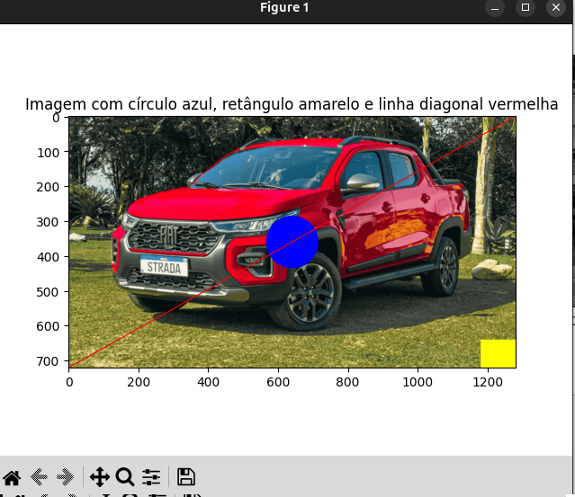
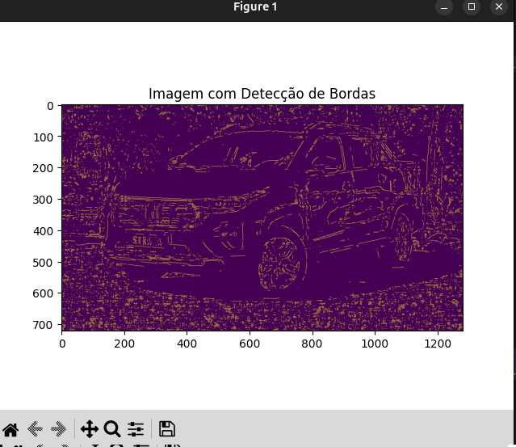

**Sobre a atividade:**

A atividade é sobre modificar imagens, utilizando a matplotlib e o opencv no python, facilitando a posterior utilização delas em diversos contextos computacionais.

**Resumo final:**

Aprendi que a manipulação de pixels permite alterar diretamente o conteúdo da imagem, desenhando formas, mudando cores e inserindo elementos visuais. 
Já os histogramas coloridos mostram a distribuição de intensidade em cada canal (vermelho, verde e azul) separadamente, enquanto o histograma em escala de cinza representa a intensidade de luz de toda a imagem em apenas um canal. 
O detector de bordas foi útil para destacar contornos e formas, permitindo identificar regiões de interesse, podendo ser usado para contornos em visão computacional, como para identificar rostos. 
Já as transformações geométricas, como redimensionar, rotacionar, transladar e refletir, são ferramentas importantes em visão computacional para alinhar imagens, preparar dados e reconhecer padrões em diferentes orientações.

**Prints:**
# Resultados das Etapas

## Parte 1

## Parte 2

## Parte 3

## Parte 4

## Parte 5

